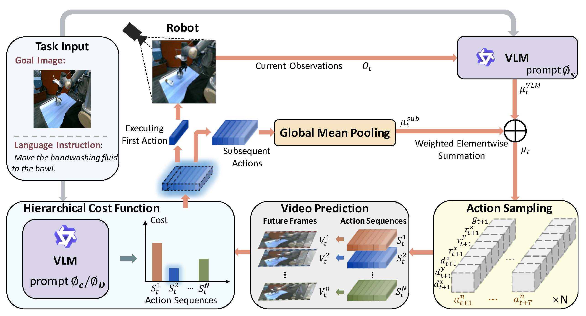

# VLMPC & Traj-VLMPC
 
 This is the official repo for our papers:
 
 1. [VLMPC: Vision-Language Model Predictive Control for Robotic Manipulation](https://www.roboticsproceedings.org/rss20/p106.pdf), ***RSS2024***
 
 &ensp;&ensp;&ensp;&ensp;[Wentao Zhao*](https://taoshuaiz.github.io/), [Jiaming Chen*](https://ppjmchen.github.io/), Ziyu Meng, Donghui Mao, [Ran Song†](https://faculty.sdu.edu.cn/songran/en/index/1023305/list/index.htm), Wei Zhang
 
 2. [Vision-Language Model Predictive Control for Manipulation Planning and Trajectory Generation](https://arxiv.org/abs/2504.05225)
 
 &ensp;&ensp;&ensp;&ensp;[Jiaming Chen*](https://ppjmchen.github.io/), [Wentao Zhao*](https://taoshuaiz.github.io/), ,Ziyu Meng, Donghui Mao, [Ran Song†](https://faculty.sdu.edu.cn/songran/en/index/1023305/list/index.htm), [Wei Pan](https://panweihit.github.io/) , Wei Zhang
 
 We provide the implementation of VLMPC in [Language-Table](https://github.com/google-research/language-table) environment.
 
 
 
 
 
 ## Installation
 
 
 ```bash
 conda create -n vlmpc python=3.10
 conda activate vlmpc
 
 pip install -r requirements.txt
 ```
 
 **Note**: Add your [Openai API](https://openai.com/index/openai-api/) key to the vlmpc.py.
 
 
 ## Quickstart
 
 We provide the trained checkpoints of [video prediction model](https://drive.google.com/file/d/1nztdUl4wanRXscNblmhX2_FF0Y2--TqF/view?usp=drive_link) and [detector](https://drive.google.com/file/d/1bjaxhmEIIav30HLdTKYvM-IWLqcIyCS7/view?usp=drive_link), download them for quick start:
 
 ```python
 python main.py --checkpoint_file path/to/video_prediction_model/checkpoint --task push_corner --zoom 0.03 --num_samples 50 --plan_freq 3 --det_path path/to/detector/checkpoint
 ```
 
 ## Citation
 ```
 @inproceedings{zhao2024vlmpc,
     title={VLMPC: Vision-Language Model Predictive Control for Robotic Manipulation},
     author={Zhao, Wentao and Chen, Jiaming and Meng, Ziyu and Mao, Donghui and Song, Ran and Zhang, Wei},
     booktitle={Robotics: Science and Systems},
     year={2024},
     }
 ```
 
 ## Acknowledgements
 - Environment is based on [Language-Table](https://interactive-language.github.io/).
 - The implementation of DMVFN-Act video prediction model is based on [DMVFN](https://github.com/hzwer/CVPR2023-DMVFN).
 - [PySOT](https://github.com/STVIR/pysot) for lightweight visual tracking.
 
